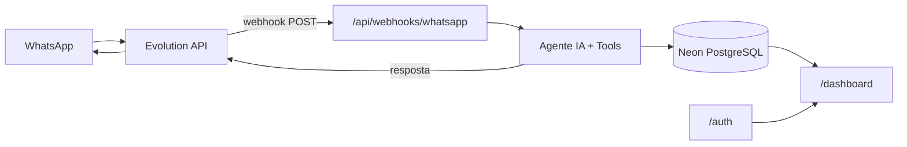

# 01 — Arquitetura

## Visão geral



Dois canais de entrada:

1. **WhatsApp** — escrita (criar, finalizar, listar tarefas) via linguagem natural
2. **Dashboard web** — leitura (timesheet, métricas, filtros)

---

## Stack tecnológica

| Camada | Tecnologia |
|--------|------------|
| Framework | Next.js 16 (App Router, React 19) |
| Banco de dados | PostgreSQL (Neon) |
| ORM | Drizzle |
| Auth | NextAuth.js v5 (Auth.js) |
| Estilização | Tailwind CSS 4 |
| Componentes | shadcn/ui + Magic UI |
| IA | Vercel AI SDK + Google Gemini |
| WhatsApp | Evolution API |

---

## Rotas

### Páginas

| Rota | Proteção | Descrição |
|------|----------|-----------|
| `/` | Pública | Vazia no MVP. Reservada para landing futura. |
| `/auth` | Pública | Login e registro via NextAuth (magic link ou OAuth). |
| `/dashboard` | Protegida | Painel de visualização do timesheet. Requer sessão ativa. |

### API

| Rota | Método | Descrição |
|------|--------|-----------|
| `/api/webhooks/whatsapp` | POST | Recebe eventos de mensagem da Evolution API |
| `/api/auth/[...nextauth]` | GET/POST | Handlers do NextAuth |

---

## Fluxo WhatsApp (webhook)

```
1. Usuário envia mensagem (texto) no WhatsApp
2. Evolution API dispara POST para /api/webhooks/whatsapp
3. Handler valida token/assinatura do webhook
4. Ignora eventos irrelevantes (status, mensagens próprias, etc.)
5. Normaliza payload → { phone, text, messageId, timestamp }
6. Upsert do usuário pelo telefone (cria se não existir)
7. Busca tarefas abertas do usuário (contexto para o agente)
8. Chama agente IA com tools (generateText + maxSteps)
9. Tool executa operação no banco via Drizzle
10. Agente formata resposta amigável em português
11. Envia resposta via Evolution API (sendText)
12. Persiste log da mensagem (in + out)
13. Retorna HTTP 200
```

**Requisitos de confiabilidade:**

- Idempotência por `messageId` (não processar duplicatas)
- Resposta do webhook em < 30s
- Mensagens de erro amigáveis devolvidas ao WhatsApp

---

## Fluxo Dashboard

```
1. Usuário acessa /dashboard
2. Middleware NextAuth verifica sessão → redireciona para /auth se ausente
3. Server Component busca tarefas e métricas via Drizzle
4. Renderiza tabela + cards de métricas + filtros de período
5. Client Component faz polling a cada 10s para atualização
```

---

## Identidade do usuário

- **WhatsApp:** identidade primária = número de telefone (`remoteJid` normalizado, ex: `5511999999999`)
- **Dashboard:** vinculado via NextAuth (e-mail) → associado ao registro `users` no banco
- Um usuário pode ter telefone WhatsApp + e-mail de login no mesmo registro

---

## Estrutura de pastas

```
personal-assistence/
├── docs/                          # Esta documentação
├── docker-compose.yml             # Evolution API (dev)
├── web/
│   ├── src/
│   │   ├── app/
│   │   │   ├── page.tsx           # / — vazia no MVP
│   │   │   ├── auth/
│   │   │   │   └── page.tsx       # /auth — login
│   │   │   ├── dashboard/
│   │   │   │   └── page.tsx       # /dashboard — protegida
│   │   │   ├── api/
│   │   │   │   ├── auth/
│   │   │   │   │   └── [...nextauth]/
│   │   │   │   │       └── route.ts
│   │   │   │   └── webhooks/
│   │   │   │       └── whatsapp/
│   │   │   │           └── route.ts
│   │   │   ├── layout.tsx
│   │   │   └── globals.css
│   │   ├── lib/
│   │   │   ├── db/
│   │   │   │   ├── index.ts       # Drizzle client
│   │   │   │   └── schema.ts      # Tabelas e relations
│   │   │   ├── auth/
│   │   │   │   └── config.ts      # NextAuth config
│   │   │   ├── ai/
│   │   │   │   ├── agent.ts       # Orquestrador generateText
│   │   │   │   └── tools/
│   │   │   │       ├── iniciar-tarefa.ts
│   │   │   │       ├── finalizar-tarefa.ts
│   │   │   │       └── listar-tarefas.ts
│   │   │   ├── whatsapp/
│   │   │   │   ├── evolution-client.ts
│   │   │   │   └── parse-webhook.ts
│   │   │   └── tasks/
│   │   │       ├── queries.ts
│   │   │       └── metrics.ts
│   │   ├── components/
│   │   │   ├── dashboard/
│   │   │   │   ├── TaskTable.tsx
│   │   │   │   ├── MetricsCards.tsx
│   │   │   │   └── PeriodFilter.tsx
│   │   │   └── ui/                # shadcn components
│   │   └── middleware.ts          # Proteção de rotas
│   ├── drizzle/
│   │   └── migrations/
│   └── drizzle.config.ts
```

---

## Decisões de escopo (MVP)

| Decisão | Escolha |
|---------|---------|
| Multi-usuário | Sim — 1 telefone = 1 usuário |
| Mensagens de áudio | Gemini multimodal (transcrição) |
| Tempo real no dashboard | Polling a cada 10s |
| Fuso horário | UTC no banco; timezone por usuário na exibição |
| Tarefas abertas simultâneas | Permitidas |
| Match semântico ao finalizar | Responsabilidade do LLM (contexto no system prompt) |
| Início retroativo | Fora do MVP — usa `now()` como `started_at` |

---

## Ordem de implementação

```
Fase 1 — Fundação
  □ Schema Drizzle + migrations no Neon
  □ Tools CRUD testáveis via script
  □ NextAuth em /auth
  □ /dashboard protegido com dados mock

Fase 2 — Agente IA
  □ Agent + 3 tools end-to-end no banco
  □ Testes manuais via rota de debug

Fase 3 — WhatsApp
  □ Docker Compose com Evolution API
  □ Webhook + envio de resposta
  □ Fluxo completo: msg → tool → confirmação

Fase 4 — Dashboard real
  □ Queries e métricas reais
  □ Filtros (Hoje / Últimos 7 dias)
  □ Design system aplicado

Fase 5 — Polish
  ✓ Idempotência de webhook (external_message_id unique)
  ✓ Tratamento de erros amigável
  ✓ Áudio (Gemini)
  ✓ Vincular telefone ↔ conta do dashboard
```
