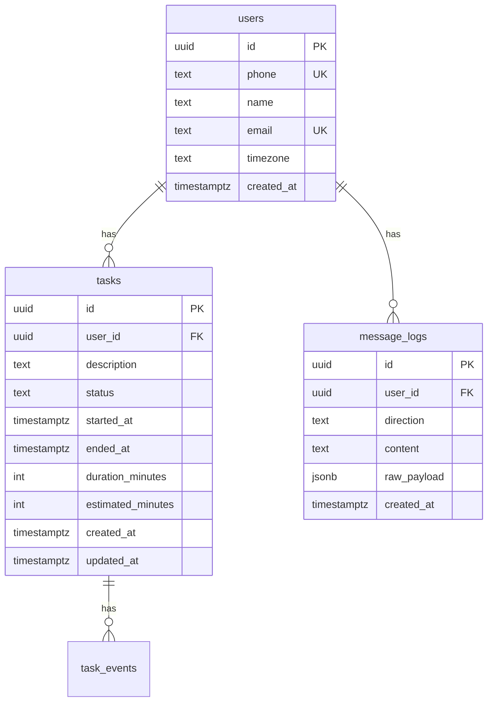

# 02 — Banco de Dados

PostgreSQL hospedado no **Neon**, acesso via **Drizzle ORM**.

---

## Diagrama ER



---

## Tabelas

### `users`

Identidade primária via telefone WhatsApp. E-mail usado para auth do dashboard.

| Coluna | Tipo | Constraints | Descrição |
|--------|------|-------------|-----------|
| `id` | `uuid` | PK, default `gen_random_uuid()` | Identificador |
| `phone` | `text` | UNIQUE, NOT NULL | Telefone normalizado (ex: `5511999999999`) |
| `name` | `text` | nullable | Nome do usuário (push name do WhatsApp) |
| `email` | `text` | UNIQUE, nullable | E-mail para NextAuth |
| `timezone` | `text` | default `'America/Sao_Paulo'` | Fuso para cálculos de "hoje" e "semana" |
| `created_at` | `timestamptz` | default `now()` | Data de criação |

### `tasks`

Registro de tarefas com ciclo de vida `active` → `paused` → `closed`. Apenas uma tarefa `active` por usuário; tempo conta só em `active`.

| Coluna | Tipo | Constraints | Descrição |
|--------|------|-------------|-----------|
| `id` | `uuid` | PK, default `gen_random_uuid()` | Identificador |
| `user_id` | `uuid` | FK → users.id, NOT NULL | Dono da tarefa |
| `description` | `text` | NOT NULL | Descrição livre |
| `status` | `text` | NOT NULL, enum (`active`, `paused`, `closed`) | Estado atual |
| `tracked_minutes` | `integer` | default `0` | Minutos acumulados (trechos ativos já encerrados) |
| `activated_at` | `timestamptz` | nullable | Início do trecho ativo atual |
| `started_at` | `timestamptz` | NOT NULL | Primeira vez que a tarefa começou |
| `ended_at` | `timestamptz` | nullable | Término (NULL enquanto não fechada) |
| `duration_minutes` | `integer` | nullable | Calculado ao fechar |
| `estimated_minutes` | `integer` | nullable | Estimativa informada na criação |
| `created_at` | `timestamptz` | default `now()` | |
| `updated_at` | `timestamptz` | default `now()` | |

### `task_events`

Auditoria do ciclo de vida de cada tarefa (início, pausa, retomada, finalização). Alimenta a timeline no dashboard.

| Coluna | Tipo | Descrição |
|--------|------|-----------|
| `id` | `text` | PK |
| `task_id` | `text` | FK → tasks.id |
| `user_id` | `text` | FK → users.id |
| `type` | `enum` | `started`, `paused`, `resumed`, `finished` |
| `occurred_at` | `timestamptz` | Momento do evento |
| `segment_minutes` | `integer` | Minutos do trecho ativo encerrado (pausa/fim) |
| `tracked_minutes_after` | `integer` | Total acumulado após o evento |
| `metadata` | `jsonb` | Ex.: tarefa que causou pausa automática |

### `message_logs`

Auditoria de mensagens WhatsApp (entrada e saída). Útil para debug e idempotência.

| Coluna | Tipo | Constraints | Descrição |
|--------|------|-------------|-----------|
| `id` | `uuid` | PK, default `gen_random_uuid()` | |
| `user_id` | `uuid` | FK → users.id, nullable | |
| `direction` | `text` | CHECK (`in`, `out`) | Direção da mensagem |
| `content` | `text` | nullable | Texto da mensagem |
| `raw_payload` | `jsonb` | nullable | Payload completo do webhook |
| `created_at` | `timestamptz` | default `now()` | |

---

## Schema Drizzle (referência)

```typescript
// src/lib/db/schema.ts

import { pgTable, uuid, text, integer, timestamp, jsonb, pgEnum } from "drizzle-orm/pg-core";
import { relations } from "drizzle-orm";

export const taskStatusEnum = pgEnum("task_status", ["open", "closed"]);
export const messageDirectionEnum = pgEnum("message_direction", ["in", "out"]);

export const users = pgTable("users", {
  id: uuid("id").primaryKey().defaultRandom(),
  phone: text("phone").notNull().unique(),
  name: text("name"),
  email: text("email").unique(),
  timezone: text("timezone").notNull().default("America/Sao_Paulo"),
  createdAt: timestamp("created_at", { withTimezone: true }).notNull().defaultNow(),
});

export const tasks = pgTable("tasks", {
  id: uuid("id").primaryKey().defaultRandom(),
  userId: uuid("user_id").notNull().references(() => users.id),
  description: text("description").notNull(),
  status: taskStatusEnum("status").notNull().default("open"),
  startedAt: timestamp("started_at", { withTimezone: true }).notNull(),
  endedAt: timestamp("ended_at", { withTimezone: true }),
  durationMinutes: integer("duration_minutes"),
  estimatedMinutes: integer("estimated_minutes"),
  createdAt: timestamp("created_at", { withTimezone: true }).notNull().defaultNow(),
  updatedAt: timestamp("updated_at", { withTimezone: true }).notNull().defaultNow(),
});

export const messageLogs = pgTable("message_logs", {
  id: uuid("id").primaryKey().defaultRandom(),
  userId: uuid("user_id").references(() => users.id),
  direction: messageDirectionEnum("direction").notNull(),
  content: text("content"),
  rawPayload: jsonb("raw_payload"),
  createdAt: timestamp("created_at", { withTimezone: true }).notNull().defaultNow(),
});

export const usersRelations = relations(users, ({ many }) => ({
  tasks: many(tasks),
  messageLogs: many(messageLogs),
}));

export const tasksRelations = relations(tasks, ({ one }) => ({
  user: one(users, { fields: [tasks.userId], references: [users.id] }),
}));
```

---

## Índices

```sql
CREATE INDEX idx_tasks_user_status ON tasks (user_id, status);
CREATE INDEX idx_tasks_user_started ON tasks (user_id, started_at DESC);
CREATE INDEX idx_message_logs_user ON message_logs (user_id, created_at DESC);
```

---

## Regras de negócio

### Criação de tarefa (`iniciar_tarefa`)

- Insere com `status = 'open'`, `started_at = now()` (UTC)
- `estimated_minutes` opcional
- Múltiplas tarefas abertas permitidas

### Finalização de tarefa (`finalizar_tarefa`)

- Busca tarefas com `status = 'open'` do usuário
- LLM seleciona a tarefa correta via contexto
- Define `ended_at` (now ou retroativo se informado)
- Calcula `duration_minutes = round((ended_at - started_at) / 60s)`
- Atualiza `status = 'closed'`

### Métricas

**Horas do dia** — tarefas fechadas cujo `ended_at` (convertido para timezone do usuário) cai no dia corrente:

```sql
SELECT COALESCE(SUM(duration_minutes), 0)
FROM tasks
WHERE user_id = $1
  AND status = 'closed'
  AND (ended_at AT TIME ZONE $timezone)::date = (now() AT TIME ZONE $timezone)::date;
```

**Tarefas abertas** — tempo parcial = `now() - started_at` (não entra no total fechado).

**Horas da semana** — mesma lógica, filtrando últimos 7 dias no timezone do usuário.

---

## Migrations

```bash
# Gerar migration após alterar schema.ts
npx drizzle-kit generate

# Aplicar no Neon
npx drizzle-kit migrate

# Visualizar banco (dev)
npx drizzle-kit studio
```

### drizzle.config.ts

```typescript
import { defineConfig } from "drizzle-kit";

export default defineConfig({
  schema: "./src/lib/db/schema.ts",
  out: "./drizzle/migrations",
  dialect: "postgresql",
  dbCredentials: {
    url: process.env.DATABASE_URL!,
  },
});
```

---

## Finanças (caixinhas) — migration `0009_finances`

| Tabela | Descrição |
|--------|-----------|
| `finance_boxes` | Caixinhas do usuário (perfil, meta, prioridade) |
| `finance_movements` | Ledger de entradas e saídas por caixinha |
| `finance_transfers` | Transferências entre caixinhas (par de movimentações) |
| `finance_categories` | Categorias opcionais para movimentações |

Enums: `finance_box_profile`, `finance_movement_type`. Valores monetários em centavos (`integer`).

### Alocação (migration `0010_finance_allocation`)

| Tabela | Descrição |
|--------|-----------|
| `finance_income_sources` | Fontes de renda (fixa/variável) |
| `finance_user_settings` | Renda fixa mensal do usuário |
| `finance_allocations` | Evento de distribuição de renda |
| `finance_allocation_items` | Itens da alocação por caixinha |

Colunas adicionadas em `finance_movements`: `allocation_id`, `income_source_id`.

---

## NextAuth — tabelas adicionais

NextAuth v5 com adapter Drizzle requer tabelas de sessão. Serão adicionadas via `@auth/drizzle-adapter` na implementação:

- `accounts`
- `sessions`
- `verification_tokens`

Essas tabelas coexistem no mesmo banco Neon, no schema `public`.
