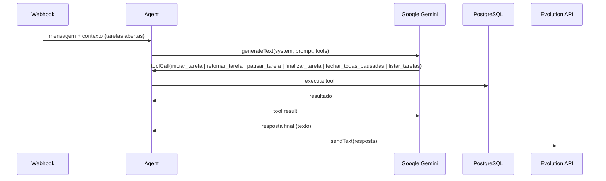

# 03 — Ferramentas de IA

Orquestração via **Vercel AI SDK** (`generateText` + tools + `maxSteps`).

---

## Pacotes

```
ai
@ai-sdk/google
zod
```

---

## Fluxo do agente



---

## System prompt

```
Você é um assistente de apontamento de horas via WhatsApp.

Regras:
- Responda SEMPRE em português brasileiro, de forma curta e amigável.
- Use emojis com moderação (✅ ❌ 📋 ⏱).
- Se a intenção não for clara, pergunte antes de agir.
- Não invente tarefas — use apenas as tools disponíveis.
- Ao finalizar, se houver ambiguidade entre tarefas abertas, peça confirmação.

Contexto do usuário:
- Timezone: {user.timezone}
- Nome: {user.name || "Usuário"}

Tarefas abertas atuais:
{openTasks.length === 0
  ? "Nenhuma tarefa aberta."
  : openTasks.map(t => `- [${t.id.slice(0, 8)}] ${t.description} (desde ${formatTime(t.startedAt)})`).join("\n")
}
```

---

## Tools

### `iniciar_tarefa`

Inicia tarefa `active`; pausa a ativa anterior. Se existir pausada com descrição parecida, dispara confirmação WhatsApp (retomar vs criar nova) antes de criar registro.

### `retomar_tarefa`

Retoma tarefa `paused` pelo ID; pausa a ativa atual.

### `pausar_tarefa`

Pausa a tarefa em andamento sem finalizar.

### `fechar_todas_pausadas`

Finaliza todas as tarefas `paused` de uma vez.

**Schema Zod:**

```typescript
{
  descricao: z.string().describe("Descrição da tarefa informada pelo usuário"),
  tempo_estimado_minutos: z.number().int().positive().optional()
    .describe("Tempo estimado em minutos, se informado"),
}
```

**Execução:**

1. `INSERT INTO tasks (user_id, description, status, started_at, estimated_minutes)`
2. Retorna `{ taskId, description, startedAt }`

**Exemplos de input do usuário:**

| Mensagem | Tool call |
|----------|-----------|
| "Comecei a trabalhar no relatório mensal" | `iniciar_tarefa({ descricao: "relatório mensal" })` |
| "Iniciando reunião com cliente, estimo 1h" | `iniciar_tarefa({ descricao: "reunião com cliente", tempo_estimado_minutos: 60 })` |
| "Vou codar a feature de login agora" | `iniciar_tarefa({ descricao: "feature de login" })` |

**Resposta esperada ao usuário:**

> ✅ Tarefa iniciada: **relatório mensal**
> ⏱ Início: 14:32

---

### `finalizar_tarefa`

Finaliza uma tarefa aberta, calculando duração.

**Schema Zod:**

```typescript
{
  task_id: z.string().uuid().describe("ID da tarefa a finalizar"),
  horario_termino: z.string().optional()
    .describe("Horário de término retroativo (ISO 8601 ou HH:mm). Se omitido, usa agora."),
}
```

> O LLM escolhe o `task_id` com base na lista de tarefas abertas no system prompt. Não há match semântico no backend.

**Execução:**

1. Busca task WHERE `id = task_id AND user_id AND status = 'open'`
2. Se não encontrada → erro
3. Define `ended_at` (now ou parse de `horario_termino` no timezone do usuário)
4. Calcula `duration_minutes`
5. Atualiza `status = 'closed'`
6. Retorna `{ taskId, description, durationMinutes, endedAt }`

**Exemplos:**

| Mensagem | Tool call |
|----------|-----------|
| "Terminei o relatório" | `finalizar_tarefa({ descricao: "relatório" })` ou handler direto |
| "Finalizei a reunião às 15:30" | `finalizar_tarefa({ descricao: "reunião", horario_termino: "15:30" })` |
| "Finalizar tarefa" (1 em andamento) | Handler/tool sem parâmetros — finaliza a ativa automaticamente |

**Resposta esperada:**

> ✅ Tarefa finalizada: **relatório mensal**
> ⏱ Duração: 1h 23min

---

### `listar_tarefas`

Consulta tarefas abertas e total de horas do dia.

**Schema Zod:**

```typescript
{} // sem parâmetros
```

**Execução:**

1. Busca tasks WHERE `user_id AND status = 'open'`
2. Calcula total de minutos do dia (tarefas closed + tempo parcial das open)
3. Retorna `{ openTasks[], totalMinutesToday }`

**Resposta esperada:**

> 📋 **Tarefas abertas:**
> • relatório mensal — 1h 23min em andamento
> • feature de login — 45min em andamento
>
> ⏱ Total hoje: 3h 08min

---

## Configuração do agente

```typescript
import { generateText, tool } from "ai";
import { getAgentModel } from "@/lib/ai/model";

const result = await generateText({
  model: getAgentModel(),
  system: buildSystemPrompt(user, openTasks),
  prompt: userMessage,
  tools: {
    iniciar_tarefa: tool({ description: "...", parameters: schema, execute: fn }),
    finalizar_tarefa: tool({ description: "...", parameters: schema, execute: fn }),
    listar_tarefas: tool({ description: "...", parameters: schema, execute: fn }),
  },
  stopWhen: stepCountIs(3),
});
```

**Modelo:** `gemini-2.5-flash` — versão estável (GA) da linha Flash; bom custo/latência para tool calling e transcrição de áudio.

---

## Casos de borda

| Cenário | Comportamento |
|---------|---------------|
| "Finalizei" com 1 tarefa aberta | Fecha automaticamente |
| "Finalizei" com N tarefas abertas | Agente pergunta qual |
| "Ok", "Valeu", "Obrigado" | Resposta conversacional, sem tool |
| Mensagem ambígua | Agente pede clarificação |
| Telefone desconhecido | Auto-cria user, depois processa |
| `task_id` inválido na finalização | Tool retorna erro; agente informa |
| Finalizar tarefa já fechada | Tool retorna erro; agente informa |
| Tarefa duplicada (mesma descrição) | Permitido — IDs diferentes |
| Horário retroativo inválido | Tool retorna erro; agente pede correção |
| Mensagem duplicada (retry webhook) | Ignorada por idempotência (`messageId`) |

---

## Idempotência

Antes de processar, a mensagem é registrada com `external_message_id` único (constraint no banco). Duplicatas do webhook são ignoradas automaticamente via `ON CONFLICT`.

---

## Áudio (Gemini)

1. Evolution API envia `audioMessage` no webhook (ideal: `webhookBase64: true`)
2. **Base64 no webhook** → usa direto; senão **`POST /chat/getBase64FromMediaMessage/{instance}`** com `data.key` (Evolution descriptografa)
3. URLs `.enc` do WhatsApp **nunca** são baixadas diretamente pelo Next.js
4. Validação antes do Gemini: magic bytes OGG/MP3, tamanho da transcrição vs áudio, bloqueio de padrões de alucinação
5. Agente: **no máximo 1 `iniciar_tarefa`** e **2 steps** por mensagem

Mensagens de mídia não suportada (imagem, vídeo, etc.) recebem resposta amigável no WhatsApp.
